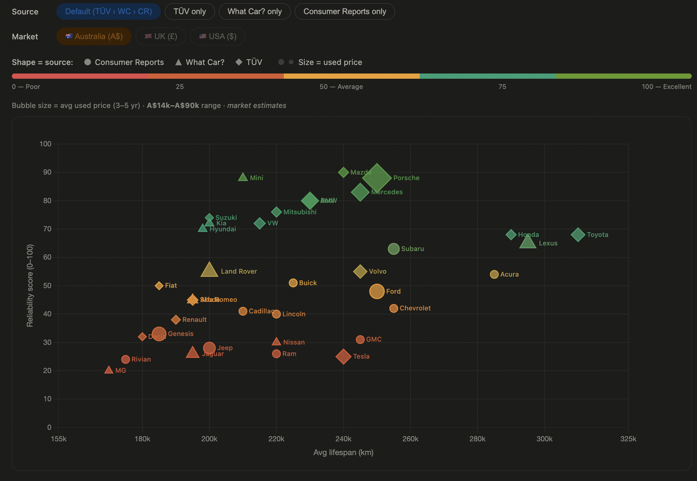

# Car Reliability vs Longevity — Global Data Explorer

An interactive scatter plot comparing car brand reliability scores across three independent global surveys, plotted against average vehicle lifespan and used car prices across markets.

**[View live demo →](https://sseveur.github.io/car-reliability-viz)**



---

## What it shows

- **X axis** — Average vehicle lifespan (km), estimated from iSeeCars & Junk Car Medics data
- **Y axis** — Reliability score (0–100), normalised from one of three surveys
- **Color** — Encodes the reliability score (red → amber → green)
- **Shape** — Encodes the data source (circle = CR, triangle = What Car?, diamond = TÜV)
- **Bubble size** — Median used car price (3–5 year old vehicle) in the selected market

---

## Data sources

| Source | Region | Sample | Year | Raw format |
|--------|--------|--------|------|------------|
| [Consumer Reports](https://www.consumerreports.org) | US | ~380,000 vehicles | Dec 2025 | 0–100 score (native) |
| [What Car?](https://www.whatcar.com) | UK | ~30,000 owners, 31 brands | 2024 | % reliability score → rescaled |
| [TÜV Report](https://www.tuv.com) | Europe | 9.5M German MOT inspections | Nov 2025 | Per-model defect % → inverted |
| [iSeeCars](https://www.iseecars.com/longest-lasting-car-brands-study) | US | 174M+ vehicles | 2025 | % reaching 250k miles → estimated km |
| [Junk Car Medics](https://www.junkcarmedics.com/blog/what-is-the-lifespan-of-a-vehicle-in-the-usa/) | US | 50k junked cars | 2024 | Avg miles at junking → estimated km |

AU used car prices from the [Australian Vehicle Prices](https://www.kaggle.com/datasets/nelgiriyewithana/australian-vehicle-prices) Kaggle dataset (~16,800 real listings).

---

## Data quality & transparency

Not all data in this visualisation is equally reliable. Some scores are taken directly from published sources, others are estimated from partial public data using conversion formulas.

**See [METHODOLOGY.md](METHODOLOGY.md) for full details**, including:
- Exact conversion formulas for each source
- Confidence levels per data point (verified vs estimated)
- Known limitations and biases
- A per-component breakdown of what's solid and what's weak

**In short:** AU prices and the top-ranked brands from each survey are well-sourced. The X-axis (km lifespan) is the weakest component — all values are estimates. Mid-to-low ranked CR scores and TÜV brand aggregates are approximations from partial data.

---

## Default source priority

When "Default" mode is selected, the chart uses:
1. **TÜV** first (largest dataset, most independent)
2. **What Car?** if no TÜV data for that brand
3. **Consumer Reports** as fallback

This provides the widest brand coverage and prioritises the largest dataset.

---

## Project structure

```
car-reliability-viz/
├── index.html          # Self-contained website (GitHub Pages entry point)
├── data.js             # Brand data & market definitions (ES modules)
├── chart.js            # Chart.js config, color helpers, label plugin
├── main.js             # App entrypoint — wires up controls & renders
├── METHODOLOGY.md      # Full data methodology & confidence levels
├── README.md
└── .github/
    └── workflows/
        └── pages.yml   # GitHub Actions for auto-deploy to Pages
```

The `index.html` is fully self-contained (no build step needed) — all logic is inlined. The separate `.js` files are the modular version for development.

---

## Updating the data

All brand data lives in `data.js` (and duplicated inline in `index.html`). Each brand entry looks like:

```js
{ n: "Toyota", km: 310000, cr: 66, wc: 84, tuv: 76, au: 41447, au_min: 17990, au_max: 299900 }
```

| Field | Description |
|-------|-------------|
| `n`   | Brand name |
| `km`  | Estimated avg lifespan in km |
| `cr`  | Consumer Reports score (0–100), or `null` |
| `wc`  | What Car? normalised score (0–100), or `null` |
| `tuv` | TÜV normalised score (0–100), or `null` |
| `au`  | Median used price in AUD, or `null` |
| `au_min` | Min used price in AUD, or `null` |
| `au_max` | Max used price in AUD, or `null` |

---

## Contributing

This project is open source and the data can always be better. Contributions are welcome — whether it's correcting a single brand's score, adding price data for a new market, or improving the methodology.

**What would help most right now:**
- Full CR brand scores (ranks 10-26) from a Consumer Reports subscription
- What Car? mid-table brand percentages (ranks 11-21)
- Full TÜV model defect rates from the AutoBild annual edition (~5 EUR)
- Used car price datasets for EUR, US, or UK markets
- Better longevity data from any source that directly measures average lifespan by brand

**How to contribute:**
- Open an issue or pull request on [GitHub](https://github.com/sseveur/car-reliability-viz)
- If submitting new data, please include: the source URL, the raw values before any conversion, and which formula was applied
- Even partial improvements help — fixing one brand's score is valuable

See [METHODOLOGY.md](METHODOLOGY.md) for the full data pipeline and conversion formulas.

---

## License

MIT — data is from public sources credited above. Chart built with [Chart.js](https://www.chartjs.org).
